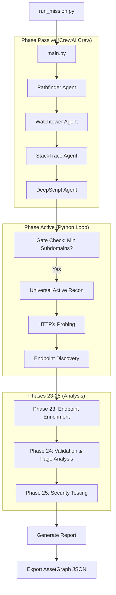

# Recon Gotham - Documentation Complète

## Table des Matières

1. [Vue d'ensemble](#vue-densemble)
2. [Architecture du Système](#architecture-du-système)
3. [Flux d'Exécution](#flux-dexécution)
4. [Composants Principaux](#composants-principaux)
5. [Outils (Tools)](#outils-tools)
6. [Core Modules](#core-modules)
7. [Configuration](#configuration)
8. [Interactions entre Composants](#interactions-entre-composants)
9. [Phases de la Mission](#phases-de-la-mission)

---

## Vue d'ensemble

**Recon Gotham** est un système multi-agents de reconnaissance offensive automatisée basé sur le framework **CrewAI**. Il orchestre plusieurs agents spécialisés pour effectuer une cartographie complète d'une surface d'attaque web.

### Objectif Principal
Découvrir, cartographier et évaluer les vulnérabilités potentielles d'un domaine cible via:
- Découverte passive (DNS, subdomains, Wayback Machine)
- Reconnaissance active (HTTP probing, JS mining)
- Analyse de sécurité (endpoint heuristics, vulnerability assessment)

---

## Architecture du Système

```
┌─────────────────────────────────────────────────────────────────┐
│                        run_mission.py                           │
│                     (Point d'entrée CLI)                        │
└─────────────────────────┬───────────────────────────────────────┘
                          │
                          ▼
┌─────────────────────────────────────────────────────────────────┐
│                         main.py                                  │
│              (Orchestrateur Principal - 35KB)                   │
│  ┌────────────────────────────────────────────────────────────┐ │
│  │  Passive Phase  │  Active Phase  │  Analysis Phase        │ │
│  │  (CrewAI Crew)  │  (Python Loop) │  (Phases 23-25)        │ │
│  └────────────────────────────────────────────────────────────┘ │
└───────┬──────────────────────┬──────────────────────┬───────────┘
        │                      │                      │
        ▼                      ▼                      ▼
┌───────────────┐    ┌───────────────┐    ┌───────────────────────┐
│    TOOLS/     │    │     CORE/     │    │       CONFIG/         │
│ (15 outils)   │    │ (5 modules)   │    │ (agents, tasks, etc.) │
└───────────────┘    └───────────────┘    └───────────────────────┘
```

---

## Flux d'Exécution



---

## Composants Principaux

### 1. `main.py` - Orchestrateur Principal

**Localisation:** `recon_gotham/src/recon_gotham/main.py`  
**Taille:** ~35KB (770 lignes)

**Responsabilités:**
- Initialisation du système et chargement de la configuration
- Création et exécution du CrewAI Crew (agents + tasks)
- Orchestration des phases passive → active → analyse
- Ingestion des résultats dans l'AssetGraph
- Génération du rapport final

**Structure clée:**

```python
def main(target_domain: str, mode: str = "AGGRESSIVE"):
    # 1. Initialisation
    graph = AssetGraph(target_domain=target_domain)
    
    # 2. Instanciation des Tools
    subfinder_tool = SubfinderTool()
    httpx_tool = HttpxTool()
    # ... autres outils
    
    # 3. Phase Passive (CrewAI)
    crew = Crew(agents=[...], tasks=[...])
    results = crew.kickoff()
    
    # 4. Ingestion des résultats passifs
    ingest_passive_outputs(results, graph)
    
    # 5. Gate Check (minimum subdomains)
    if len(subdomains) == 0:
        generate_minimal_report()
        return
    
    # 6. Phase Active
    for url in scan_urls:
        httpx_result = httpx_tool._run(url)
        graph.add_subdomain_with_http(...)
    
    # 7. Phases 23-24-25
    enrich_endpoints(graph)
    validate_endpoints(graph)
    analyze_security(graph)
    
    # 8. Génération du rapport
    generate_mission_summary(graph, target_domain)
```

---

### 2. `AssetGraph` - Graphe de Connaissances

**Localisation:** `core/asset_graph.py`  
**Taille:** ~34KB (900 lignes)

**Structure de données:**
```python
class AssetGraph:
    nodes: List[Dict]  # Nœuds du graphe
    edges: List[Dict]  # Relations entre nœuds
    target_domain: str # Domaine cible (scope)
```

**Types de nœuds (VALID_NODE_TYPES):**
| Type | Description | Exemple |
|------|-------------|---------|
| `SUBDOMAIN` | Sous-domaine découvert | `www.example.com` |
| `HTTP_SERVICE` | Service HTTP actif | `https://www.example.com:443` |
| `ENDPOINT` | Chemin découvert | `/api/v1/users` |
| `PARAMETER` | Paramètre d'URL | `id`, `user_id` |
| `IP_ADDRESS` | Adresse IP | `192.168.1.1` |
| `DNS_RECORD` | Enregistrement DNS | `CNAME`, `TXT`, `MX` |
| `VULNERABILITY` | Vulnérabilité détectée | `CVE-2021-12345` |
| `ATTACK_PATH` | Chemin d'attaque suggéré | `/admin → SQLi` |

**Méthodes principales:**

```python
# Ajout de données
def add_subdomain(self, name: str, source: str) -> str
def add_subdomain_with_http(self, subdomain_name: str, http_data: Dict)
def add_endpoint(self, path: str, method: str, source: str, origin: str, confidence: float)
def add_parameter_v2(self, endpoint_id: str, name: str, location: str, ...)
def add_vulnerability(self, node_id: str, vuln_data: Dict)
def add_attack_path(self, target_id: str, score: int, actions: List, reasons: List)

# Invariants (Phase 23 V2.3)
def ensure_subdomain_for_url(self, url: str) -> str
def ensure_http_service_for_endpoint(self, endpoint_url: str) -> str

# Export
def export_json(self, filepath: str)  # Avec filtrage scope
```

**Logique de scope:**
```python
def is_in_scope(self, hostname: str) -> bool:
    """Vérifie si un hostname appartient au domaine cible."""
    if not self.target_domain:
        return True
    return hostname.endswith(self.target_domain) or hostname == self.target_domain
```

---

## Outils (Tools)

Tous les outils héritent de `BaseTool` (CrewAI) et exposent une méthode `_run()`.

### Outils de Découverte

#### `subfinder_tool.py` - Découverte de Sous-domaines

```python
class SubfinderTool(BaseTool):
    def _run(self, domain: str) -> str:
        """Exécute subfinder et retourne les sous-domaines en JSON."""
        result = subprocess.run(["subfinder", "-d", domain, "-json"])
        return parse_subfinder_output(result.stdout)
```

**Input:** `domain` (ex: `example.com`)  
**Output:** JSON liste des sous-domaines découverts

---

#### `httpx_tool.py` - Probe HTTP

```python
class HttpxTool(BaseTool):
    def _run(self, urls: List[str]) -> str:
        """Probe les URLs pour détecter les services HTTP actifs."""
        result = subprocess.run(["httpx", "-json", "-sc", "-tech-detect"])
        return parse_httpx_output(result.stdout)
```

**Input:** Liste d'URLs à tester  
**Output:** JSON avec status_code, technologies, titre, IP

---

#### `wayback_tool.py` - Archive Historique

```python
class WaybackTool(BaseTool):
    def _run(self, hosts: List[str]) -> str:
        """Récupère les URLs historiques depuis Wayback Machine."""
        for host in hosts:
            response = requests.get(f"http://web.archive.org/cdx/search/cdx?url={host}/*")
        return filter_endpoints(urls)
```

**Input:** Liste de hosts  
**Output:** JSON des endpoints historiques (filtrés)

---

### Outils d'Analyse

#### `page_analyzer.py` - Analyse de Page (Phase 24)

```python
class PageAnalyzer:
    def analyze_url(self, url: str) -> Dict:
        """Analyse complète d'une page web."""
        response = requests.get(url)
        soup = BeautifulSoup(response.text, 'html.parser')
        
        return {
            "forms": self._extract_forms(soup),
            "api_endpoints": self._extract_api_calls(response.text),
            "auth_mechanisms": self._detect_auth(soup),
            "technologies": self._detect_technologies(response),
            "sensitive_data": self._detect_sensitive_data(response.text),
            "attack_surface": self._build_attack_surface(analysis)
        }
```

**Détection des forms:**
- Action, method, enctype
- Champs avec types (password, hidden, etc.)

**Détection des APIs:**
- Patterns `fetch()`, `axios`, `XMLHttpRequest`
- URLs `/api/`, `/v1/`, etc.

**Intégration Ollama:**
```python
def analyze_with_ollama(self, code: str, context: str) -> str:
    """Utilise qwen2.5-coder:7b pour analyser du code."""
    response = requests.post(f"{OLLAMA_BASE_URL}/api/generate", json={
        "model": "qwen2.5-coder:7b",
        "prompt": f"Analyze this code: {code}"
    })
    return response.json()["response"]
```

---

#### `security_tester.py` - Tests de Sécurité (Phase 25)

```python
class VulnerabilityTester:
    PAYLOADS = {
        "sqli": ["'", "' OR '1'='1", "1; DROP TABLE--"],
        "xss": ["<script>alert(1)</script>", ""],
        "lfi": ["../../../etc/passwd", "..\\..\\windows\\system32\\"],
        "ssrf": ["http://localhost", "http://169.254.169.254"],
    }
    
    def analyze_endpoint_for_vulns(self, endpoint: Dict) -> Dict:
        """Identifie les vulnérabilités potentielles d'un endpoint."""
        vulns = []
        
        if "/admin" in path: vulns.append("AUTH_BYPASS")
        if ".php" in path: vulns.append("CODE_INJECTION")
        if "id=" in path: vulns.append("IDOR")
        
        return vulns
```

---

#### `endpoint_validator.py` - Validation des URLs

```python
class EndpointValidator:
    def validate_url(self, url: str) -> Dict:
        """Vérifie qu'une URL est accessible."""
        response = requests.head(url, timeout=10)
        return {
            "status_code": response.status_code,
            "reachable": True,
            "response_time_ms": elapsed_ms
        }
```

---

## Core Modules

### `endpoint_heuristics.py` - Enrichissement Phase 23

```python
def enrich_endpoint(endpoint_id, url, path, method, source, extension, ...) -> Dict:
    """Enrichit un endpoint avec des métadonnées de risque."""
    
    category = _categorize_endpoint(path)      # API, ADMIN, AUTH, LEGACY, STATIC
    params = _extract_parameters(path)          # Extraction des paramètres
    behaviors = _detect_behavior(path, params)  # ID_BASED_ACCESS, SEARCH_QUERY
    pre_score = _compute_pre_score(path, params, category)
    
    return {
        "category": category,
        "risk_score": pre_score,
        "auth_required": _infer_auth_required(path),
        "tech_stack_hint": _infer_tech_stack(path),
        "parameters": params,
        "behavior": behaviors
    }
```

**Catégories d'endpoints:**
| Catégorie | Pattern | Risque |
|-----------|---------|--------|
| `API` | `/api/`, `/v1/`, `/graphql` | Moyen |
| `ADMIN` | `/admin`, `/dashboard`, `/manage` | Haut |
| `AUTH` | `/login`, `/register`, `/oauth` | Haut |
| `LEGACY` | `.php`, `.asp`, `.jsp` | Moyen |
| `STATIC` | `.css`, `.js`, `.png` | Bas |

---

### `planner.py` - Planificateur Offensif

```python
def find_top_paths(graph: Dict) -> List[Dict]:
    """Identifie les cibles à haute valeur pour l'offensive."""
    
    candidates = []
    for node in graph["nodes"]:
        score = calculate_priority_score(node)
        actions = suggest_actions(node)
        candidates.append({
            "subdomain": node["id"],
            "score": score,
            "next_actions": actions,
            "reason": explain_score(node)
        })
    
    return sorted(candidates, key=lambda x: x["score"], reverse=True)[:10]

def suggest_actions(node: Dict) -> List[str]:
    """Suggère des actions offensives basées sur le profil du nœud."""
    actions = []
    
    if node.get("risk_score", 0) >= 40:
        actions.append("ffuf_api_fuzz")
    if node.get("risk_score", 0) >= 30 or has_vulns:
        actions.append("nuclei_scan")
    if category in ["ADMIN", "AUTH"]:
        actions.append("nuclei_auth_scan")
    
    return actions
```

---

## Configuration

### `agents.yaml` - Définition des Agents

```yaml
pathfinder:
  role: "Lead Reconnaissance Orchestrator"
  goal: "Discover all subdomains and DNS records"
  backstory: "Expert in passive reconnaissance..."

watchtower:
  role: "Senior Intelligence Analyst"
  goal: "Analyze DNS and extract intelligence"
  
tech_fingerprinter:
  role: "Senior Tech Fingerprinter (Code Name: StackTrace)"
  goal: "Identify technologies via HTTP probing"

js_intel:
  role: "JavaScript Intelligence Miner (Code Name: DeepScript)"
  goal: "Mine JavaScript files for secrets and endpoints"

page_analyzer:
  role: "Deep Page Intelligence Analyst (Code Name: DeepDive)"
  goal: "Extract forms, APIs, and backend interactions"

coder_agent:
  role: "Adaptive Code Intelligence (Code Name: Coder)"
  goal: "Generate Python scripts when tools fail"
```

---

### `tasks.yaml` - Définition des Tâches

```yaml
subdomain_discovery_task:
  description: "Discover all subdomains for {target_domain}"
  agent: pathfinder
  expected_output: "JSON list of subdomains"

tech_fingerprint_task:
  description: "Probe HTTP services and detect technologies"
  agent: tech_fingerprinter
  expected_output: "JSON with status, tech, titles"

endpoint_intel_task:
  description: "Analyze and enrich discovered endpoints"
  agent: endpoint_intel
  expected_output: "JSON with risk scores and categories"
```

---

### `.env` - Configuration Environnement

```ini
# Ollama (Local LLM)
OLLAMA_BASE_URL=http://localhost:11434
OLLAMA_CODER_MODEL=qwen2.5-coder:7b
MODEL_NAME=qwen2.5:14b

# Security Testing
CODER_AGENT_ENABLED=true
VULN_TEST_SQLI=true
VULN_TEST_XSS=true
MIN_RISK_FOR_ACTIVE_SCAN=30
MAX_ENDPOINTS_TO_ANALYZE=50
```

---

## Interactions entre Composants

### Flux de Données Principal

```
┌─────────────┐     ┌─────────────┐     ┌─────────────┐
│  SubFinder  │────▶│  AssetGraph │◀────│   HTTPX     │
│  (DNS)      │     │  (Central)  │     │  (HTTP)     │
└─────────────┘     └──────┬──────┘     └─────────────┘
                          │
       ┌──────────────────┼──────────────────┐
       ▼                  ▼                  ▼
┌─────────────┐     ┌─────────────┐     ┌─────────────┐
│  Wayback    │     │ PageAnalyzer│     │  Security   │
│  (Archive)  │     │ (Phase 24)  │     │  Tester     │
└─────────────┘     └─────────────┘     └─────────────┘
       │                  │                  │
       └──────────────────┼──────────────────┘
                          ▼
                   ┌─────────────┐
                   │  Planner    │
                   │ (Offensive) │
                   └──────┬──────┘
                          ▼
                   ┌─────────────┐
                   │   Report    │
                   │ (Summary)   │
                   └─────────────┘
```

### Relations Nœuds-Edges dans AssetGraph

```
SUBDOMAIN ──RESOLVES_TO──▶ IP_ADDRESS
    │
    ├──HAS_DNS──▶ DNS_RECORD
    │
    └──SERVES──▶ HTTP_SERVICE
                    │
                    └──EXPOSES──▶ ENDPOINT
                                    │
                                    ├──HAS_PARAMETER──▶ PARAMETER
                                    │
                                    └──HAS_VULNERABILITY──▶ VULNERABILITY
                                            │
                                            └──TARGETS──▶ ATTACK_PATH
```

---

## Phases de la Mission

### Phase 1: Passive Reconnaissance (CrewAI)

| Agent | Outil | Output |
|-------|-------|--------|
| Pathfinder | `subfinder_tool` | Subdomains JSON |
| Watchtower | `dns_resolver_tool` | DNS Records |
| StackTrace | `httpx_tool` | HTTP Services |
| DeepScript | `js_miner_tool` | JS Endpoints |

### Phase 2: Gate Check

```python
if subdomain_count == 0:
    generate_minimal_report()
    print("[-] ZERO SURFACE DETECTED")
    sys.exit(0)
```

### Phase 3: Active Reconnaissance

```python
for url in confirmed_http_services:
    # HTML Crawling
    links = html_crawler._run(url)
    for link in links:
        graph.add_endpoint(link)
    
    # JS Mining
    js_data = js_miner._run(url)
    for api in js_data:
        graph.add_endpoint(api)
```

### Phase 23: Endpoint Intelligence Enrichment

```python
for endpoint in graph.endpoints:
    enrichment = enrich_endpoint(
        path=endpoint["path"],
        method=endpoint["method"]
    )
    graph.update_endpoint_metadata(
        endpoint_id=endpoint["id"],
        category=enrichment["category"],
        risk_score=enrichment["risk_score"]
    )
```

### Phase 24: Validation & Page Analysis

```python
# Step 1: Validate URLs
for service in http_services[:15]:
    result = validator.validate_url(service.url)
    if result["reachable"]:
        reachable_urls.append(service.url)

# Step 2: Deep Page Analysis
for url in reachable_urls[:5]:
    analysis = page_analyzer.analyze_url(url)
    for form in analysis["forms"]:
        graph.add_endpoint(form.action, method=form.method)
```

### Phase 25: Security Testing

```python
for endpoint in graph.endpoints:
    vulns = security_tester.analyze_endpoint_for_vulns(endpoint)
    if vulns["high_priority"]:
        suggested_nuclei_templates.extend(vulns["suggested_tests"])
```

### Phase Finale: Report Generation

```python
def generate_mission_summary(graph, target_domain):
    report = f"""
    # Mission Summary: {target_domain}
    
    ## Asset Statistics
    - Subdomains: {count_subdomains}
    - HTTP Services: {count_http}
    - Endpoints: {count_endpoints}
    
    ## Top 5 High-Risk Endpoints
    {top_5_endpoints}
    
    ## Attack Plan
    {suggested_actions}
    """
    
    save_to_file(f"output/{target_domain}_summary.md", report)
    graph.export_json(f"output/{target_domain}_asset_graph.json")
```

---

## Résumé des Fichiers

| Fichier | Rôle | Lignes |
|---------|------|--------|
| `main.py` | Orchestrateur principal | ~770 |
| `asset_graph.py` | Graphe de connaissances | ~900 |
| `planner.py` | Planificateur offensif | ~500 |
| `endpoint_heuristics.py` | Enrichissement endpoints | ~280 |
| `page_analyzer.py` | Analyse de pages (Phase 24) | ~450 |
| `security_tester.py` | Tests sécurité (Phase 25) | ~350 |
| `endpoint_validator.py` | Validation URLs | ~250 |
| `subfinder_tool.py` | Découverte subdomains | ~260 |
| `httpx_tool.py` | Probe HTTP | ~220 |
| `agents.yaml` | Définition agents | ~180 |
| `tasks.yaml` | Définition tâches | ~400 |

---

## Commandes Utiles

```bash
# Lancer une mission complète
python run_mission.py example.com --mode aggressive

# Valider un graphe existant
python recon_gotham/src/recon_gotham/tools/endpoint_validator.py output/example.com_asset_graph.json

# Analyser la sécurité d'un graphe
python recon_gotham/src/recon_gotham/tools/security_tester.py output/example.com_asset_graph.json

# Analyser une page spécifique
python recon_gotham/src/recon_gotham/tools/page_analyzer.py https://example.com
```

---
# Recon-Gotham V3.0 — Workflow et Architecture

Ce document résume l’architecture actuelle (V3.0), le flux d’exécution et les artefacts produits.

## Vue d’ensemble
- Entrée : domaine cible + options CLI (`--mode stealth|aggressive`, `--seed-file` optionnel).
- Orchestration : `OrchestratorService` pilote des pipelines séquentielles (CrewAI + outils).
- Données : DTO Pydantic + `graph_schema` ; stockage principal dans l’`AssetGraph` (JSON export), summary Markdown, metrics JSON.
- Observabilité : logger structuré JSON (run_id), métriques par phase, files `*_live.log` et `*_metrics.json`.

## Pipelines
1) **OSINT** (`pipelines/osint_pipeline.py`)  
   Découverte passive initiale (agents org/saas/code), peu exercée dans V3.0.
2) **Recon** (`recon_pipeline.py`)  
   Pathfinder + Watchtower + StackTrace + DeepScript. Découverte subdomains via Subfinder (Docker) + bypass direct, httpx/wayback/crawler/robots pour HTTP/JS/endpoints.
3) **Safety Net** (`safety_net.py`)  
   Gate check (arrêt si 0 subdomain) + fallback apex/www + probing de rattrapage.
4) **Endpoint Intel (Phase 23)** (`endpoint_intel_pipeline.py`)  
   Enrichissement endpoints : catégorie, risk_score (matrice L*I 0–100), params, hints comportement/stack, génération d’hypothèses (IDOR, AUTH_BYPASS, SQLI, etc.).
5) **Verification (Phase 24/25)** (`verification_pipeline.py`)  
   Analyse stack/versions et tests contrôlés sur endpoints à risque. En V3.0, vulnérabilités théoriques encore à 0 (affinage à faire).
6) **Reporting** (`reporting_service.py`)  
   Exports : graph JSON, summary Markdown, metrics JSON, live log.

## Modèle de données (simplifié)
- DTO/Enums : `EndpointDTO`, `ParameterDTO`, `HypothesisDTO`, `VulnerabilityDTO`, `NodeType`, `EdgeType`.
- `AssetGraph` : noeuds SUBDOMAIN, HTTP_SERVICE, ENDPOINT, PARAMETER, HYPOTHESIS, VULNERABILITY, etc., relations EXPOSES_HTTP/EXPOSES_ENDPOINT/HAS_PARAM/HAS_HYPOTHESIS/HAS_VULNERABILITY.
- Ingestion : toujours via DTO validés (fail-soft) → `add_*_from_dto`.

## Configuration
- `config/agents.yaml` / `tasks.yaml` : rôles/tâches CrewAI.
- `config/budget.yaml` : seuils et budgets (risks, max_targets, timeouts, parallélisme, modes stealth/aggressive).
- `--seed-file` : injection de sous-domaines pour forcer des tests (optionnel).

## Outils clés
- Découverte : Subfinder (Docker) + bypass direct, Wayback, Robots, Html crawler, JS miner.
- Infra : httpx probing, DNS/ASN (à surveiller), stack detection.
- Actif : Nuclei/Ffuf branchés dans VerificationPipeline (tests contrôlés).

## Observabilité
- Logger structuré (JSON) avec `run_id`, `phase`, `component`.
- Metrics par phase dans `output/<domain>_<run_id>_metrics.json`.
- Live log `*_live.log` (événements minimalistes).

## État V3.0 (colombes.fr, sans seeds)
- Découverte : 59 subdomains, 27 services, 15 endpoints.
- Enrichissement : 14 endpoints enrichis, 3 paramètres, 7 hypothèses générées.
- Vulnérabilités théoriques : 0 (Phase 25 à affiner).
- Aucune erreur, encodage corrigé (ASCII).

## Points de vigilance
- DNS/ASN : ingestion parfois vide → à surveiller/renforcer.
- Phase 25 : création de VULNERABILITY non déclenchée (affiner seuils et logique).
- Live logs : peu verbeux (peu d’événements par tâche).

## Commandes utiles
- Run standard : `python run_mission.py <domaine> --mode aggressive`
- Run avec seeds : `python run_mission.py <domaine> --mode aggressive --seed-file test/colombes_seeds.txt`

## Prochaines améliorations possibles
- Abaisser/ajuster la policy de risque pour déclencher la création de vulnérabilités théoriques.
- Renforcer l’ingestion DNS/ASN et le logging live par tâche.
- Enrichir Phase 24/25 pour produire des VULNERABILITY avec evidence à partir des hypothèses.
