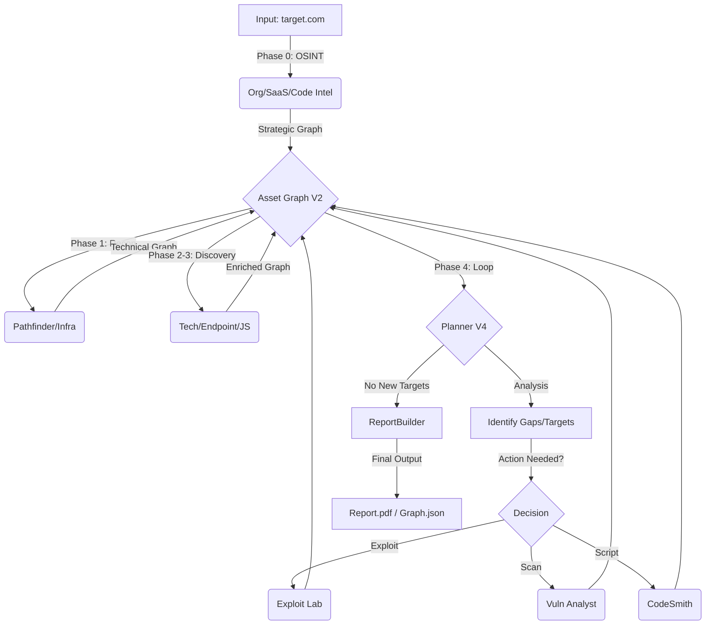

# Architecture Explained: Recon-Gotham Agent V2

## Overview
Recon-Gotham V2 is an **autonomous offensive security agent** built on [CrewAI](https://crewai.com). It orchestrates a team of specialized agents to perform the full Red Team lifecycle, now expanded with **Advanced OSINT** capabilities and an **Iterative Investigation Loop**.

The system transforms a domain (e.g., `target.com`) into a deep knowledge graph connecting **Corporate Entities** -> **SaaS Ecosystems** -> **Technical Assets** -> **Vulnerabilities** -> **Actionable Attack Chains**.

## Core Components

### 1. Orchestrator (`main.py`)
The central nervous system. It has evolved from a linear pipeline to a **Cyclical Intelligence System**:
-   **Phase 0 (OSINT)**: Parallel execution of Organization, SaaS, and Code Intelligence agents.
-   **Phase 1-3 (Technical Recon)**: Passive Subdomain/Infra mapping + Active Fingerprinting.
-   **Phase 4 (Investigation Loop)**: A `while` loop that:
    1.  Analyzes the Graph (Planner).
    2.  Identifies gaps (e.g., "Org found but no SaaS").
    3.  Triggers targeted actions (Vuln Scans, Exploit Planning, or Custom Scripts).
    4.  Repeats until no new high-value assets are found (Max 3 cycles).
-   **Resilience**: "Active Fallback" ensures coverage even on dead surfaces.

### 2. Configuration (`config/*.yaml`)
Decoupled logic defining *who* works and *what* they do.
-   **`agents.yaml`**:
    -   **OSINT Squad** (New): `OrgProfiler` (Corporate), `SaaSIntel` (3rd Party), `CodeIntel` (GitHub Mining).
    -   **Recon Squad**: `Pathfinder`, `Watchtower`, `DNS/ASN Analysts`.
    -   **Discovery Squad**: `StackTrace`, `All-Seeing Eye`, `DeepScript`.
    -   **Offensive Squad**: `VulnAnalyst`, `ParamHunter`, `ExploitLab`.
    -   **Strategic**: `Overwatch` (Planner V4).
-   **`tasks.yaml`**: Defines steps with **Strict Contracts** (JSON output rules).

### 3. Tool Wrappers (`tools/*.py`)
Bridges between AI and external binaries:
-   **OSINT**: `PythonScriptExecutorTool` (Custom Scripts via CodeSmith).
-   **Recon**: `SubfinderTool`, `DnsResolverTool`, `ASNLookupTool`.
-   **Active**: `HttpxTool`, `HtmlCrawlerTool`, `WaybackTool`.
-   **Offensive**: 
    -   `NucleiTool`: Vulnerability scanning (Dockerized).
    -   `FfufTool`: Fuzzing (Dockerized).
    -   `VulnValidator`: Validation logic.
-   **Utilities**: `JsMinerTool`, `ReportBuilder`.

### 4. Data Layer (`core/asset_graph.py`) - V2 Model
A comprehensive in-memory knowledge graph.
-   **Nodes**: 
    -   **Strategic**: `ORG`, `BRAND`, `SAAS_APP`, `LEAK`, `HYPOTHESIS`.
    -   **Technical**: `SUBDOMAIN`, `IP_ADDRESS`, `ASN`, `DNS_RECORD`, `HTTP_SERVICE`, `ENDPOINT`, `PARAMETER`, `VULNERABILITY`, `REPOSITORY`.
-   **Edges**: `ORG_USES_SAAS`, `LEAK_RELATES_TO_ORG`, `REPO_CONTAINS_FILE`, `RESOLVES_TO`, etc.

### 5. The Brain (`core/planner.py`)
Strategic reasoning engine (Planner V4).
-   **Chain Scoring**:
    -   **OSINT Chains**: `ORG` -> `SAAS (Email)` -> `Phishing Opportunity` (+5).
    -   **Leak Chains**: `REPO` -> `LEAK (API Key)` -> `Credential Stuffing` (+7).
    -   **Technical Chains**: `ENDPOINT` -> `VULN (SQLi)` -> `Exploitation` (+7).
-   **Deduplication**: Merges overlapping paths to present a clean, non-repetitive plan.

### 6. Application Flow



## Key Design Principles

### A. Active Fallbacks ("Dead Surface Policy")
If passive recon yields no results OR finding dead subdomains (0 HTTP services):
1.  **Detection**: Orchestrator flags "Low/Dead Surface".
2.  **Fallback**: Generates baseline targets (root, www) and dictionary candidates.
3.  **Active Probing**: Direct Httpx probing to force graph population.

### B. Anti-Hallucination & Anti-Pollution (Phase 17)
-   **Strict Filtering**: `AssetGraph` rejects generic examples ("Target Corp", "Example Org").
-   **Negative Constraints**: Prompts explicitly forbid inventing examples.
-   **Validation**: `VulnValidator` checks confidence before adding to Graph.

### C. Modularity
-   **Phase-Based**: New capabilities (e.g., Exploitation) are added as distinct phases in `main.py` without rewriting core logic.

## Directory Structure
```
recon-gotham/
├── knowledge/              # Memory & Mission Summaries
├── output/                 # Graphs, Plans, PDFs
├── recon_gotham/
│   ├── config/             # YAML Configs (Agents/Tasks)
│   ├── core/               # AssetGraph, Planner, Validator
│   ├── reporting/          # ReportBuilder
│   ├── tools/              # Tool Wrappers
│   └── main.py             # Orchestrator
└── docker/                 # Service Containers (Subfinder, etc.)
```
